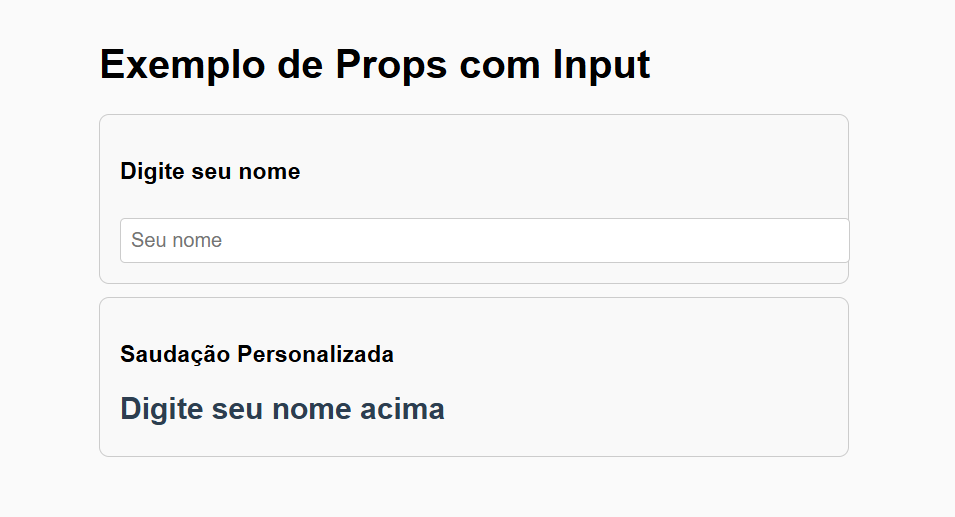

# 🚀 Projeto React com Props e Componentes — Exemplo Didático

Este projeto foi desenvolvido por **Claudeny Nivaldo Avelino** como um exemplo prático em **ReactJS com Vite**, com o objetivo de demonstrar o uso de **props**, **estado (useState)**, **componentes reutilizáveis** e **CSS externo**.

A aplicação mostra como os dados fluem entre componentes e como estruturar um projeto React de forma organizada e profissional.

---

## 🧠 Objetivo da Aplicação

A aplicação permite que o usuário digite seu nome em um campo de texto e receba uma **saudação personalizada em tempo real**.  
É um exemplo didático para entender os principais conceitos do React:

- Passagem de **props** entre componentes  
- Controle de **estado local** com `useState`  
- Uso de **children** para componentes genéricos  
- Estrutura de pastas organizada  
- Uso de **CSS externo** em cada componente

---

## 🖼️ Preview da Aplicação


> 💡 *Substitua o arquivo `preview.png` por um print da sua aplicação e mantenha esse nome para o README exibir automaticamente.*

---

## 📁 Estrutura do Projeto
```
src/
├── Componentes/
│ ├── Cartao.jsx
│ ├── Cartao.css
│ ├── Saudacao.jsx
│ └── Saudacao.css
├── App.jsx
├── main.jsx
└── index.css
```


---

## ⚙️ Tecnologias Utilizadas

- [ReactJS](https://react.dev/)
- [Vite](https://vitejs.dev/)
- [JavaScript (ES6+)](https://developer.mozilla.org/en-US/docs/Web/JavaScript)
- [CSS3](https://developer.mozilla.org/en-US/docs/Web/CSS)
- [Node.js](https://nodejs.org/)

---

## 🧩 Descrição dos Componentes

### 🔹 `App.jsx`
Componente principal.  
Gerencia o **estado** com `useState` e envia o valor digitado para outros componentes via **props**.

### 🔹 `Cartao.jsx`
Componente de apresentação.  
Serve como um “container” para agrupar conteúdo, recebendo **título** e **children** (conteúdo interno).

### 🔹 `Saudacao.jsx`
Componente responsável por exibir a **mensagem personalizada** com base na prop `nome`.

### 🔹 `CSS externo`
Cada componente possui seu próprio arquivo `.css`, mantendo o código limpo e bem organizado.

---

## 🧭 Fluxo de Funcionamento

1. O usuário digita seu nome no campo de entrada (`input`).  
2. O valor é armazenado no estado local (`useState`).  
3. O estado é passado como **prop** para `<Saudacao />`.  
4. A saudação é renderizada dinamicamente conforme o usuário digita.

**Fluxo de dados:**  
`App.jsx → Saudacao.jsx` (via props)

---

## 🛠️ Como Executar o Projeto Localmente

### 1️⃣ Clonar o repositório

```
bash
git clone https://github.com/ClaudenyAvelino/nome-do-repositorio.git
cd nome-do-repositorio
```
🧰 Pré-requisitos

* Certifique-se de ter instalado:

* Node.js (versão 16 ou superior)

**2️⃣ Instalar as dependências**

```
node -v
npm -v
```
**🚀 1. Criar o projeto com Vite**

No terminal, execute:
```
npm create vite@latest aula-react-props -- --template react
```

**📦 2. Entrar na pasta do projeto**

```
cd aula-react-props
```
**⚙️ 3. Instalar as dependências**
```
npm install
```
**▶️ 4. Rodar o projeto**

```
npm run dev
```

>O terminal mostrará algo como:
```
  VITE v5.x.x  ready in 400 ms
  ➜  Local:   http://localhost:5173/
```
>Abra esse link no navegador.

**🧩 5. Estrutura inicial do projeto**
A estrutura básica será assim:
```
aula-react-props/
├── node_modules/
├── public/
├── src/
│   ├── assets/
│   ├── App.jsx
│   ├── main.jsx
│   └── index.css
├── package.json
└── vite.config.js
```

**💡 6. Exemplo simples de uso de props**
Vamos editar `App.jsx `para mostrar um exemplo prático:

`src/App.jsx`
```
import React from 'react'
import Saudacao from './Saudacao'

function App() {
  return (
    <div>
      <h1>Exemplo de Props no React</h1>
      <Saudacao nome="Maria" />
      <Saudacao nome="João" />
      <Saudacao nome="Carla" />
    </div>
  )
}

export default App
```
`src/Saudacao.jsx`
```
import React from 'react'

function Saudacao({ nome }) {
  return <p>Olá, {nome}! Seja bem-vindo(a)!</p>
}

export default Saudacao
```

>Aqui estamos passando props (no caso, nome) para o componente Saudacao.

